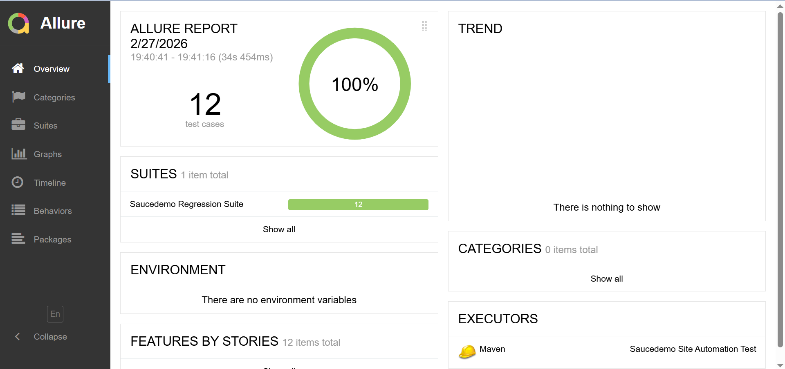
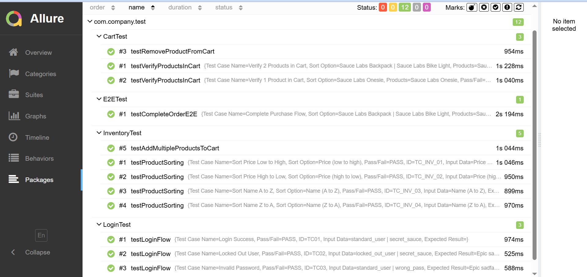

# 🛒 Saucedemo Automation Testing Framework

Dự án này là một Framework kiểm thử tự động toàn diện được thiết kế để đảm bảo chất lượng vận hành và tính toàn vẹn của dữ liệu cho hệ thống thương mại điện tử Saucedemo.

---

## 💼 1. Nghiệp vụ kiểm thử (Business Context)

Hệ thống tập trung vào việc xác thực các quy trình nghiệp vụ cốt lõi của một trang web bán hàng, đảm bảo trải nghiệm người dùng không bị gián đoạn:

* **Quản lý truy cập:** Xác thực các kịch bản đăng nhập khác nhau để đảm bảo an toàn thông tin người dùng.
* **Quản lý danh mục & Lọc dữ liệu:** Đảm bảo thuật toán sắp xếp sản phẩm hoạt động chính xác theo tiêu chí người dùng chọn.
* **Luồng giao dịch End-to-End (E2E):** Mô phỏng trọn vẹn hành trình khách hàng từ khi chọn hàng đến khi xác nhận thanh toán thành công.

---

## 🧪 2. Kịch bản kiểm thử chi tiết (Test Cases)

Dự án áp dụng chiến lược **Data-Driven Testing (DDT)**, tách biệt hoàn toàn kịch bản và dữ liệu để tăng khả năng mở rộng.

### Nhóm 1: Chức năng Đăng nhập (Login)
Dữ liệu được quản lý tại tệp `LoginData.xlsx`.

| ID | Kịch bản | Dữ liệu đầu vào | Kết quả mong đợi |
| :--- | :--- | :--- | :---: |
| **TC01** | Đăng nhập thành công | standard_user | Truy cập trang chủ sản phẩm |
| **TC02** | Tài khoản bị khóa | locked_out_user | Hiển thị lỗi "Locked out" |
| **TC03** | Sai mật khẩu | invalid_pass | Hiển thị lỗi thông tin không khớp |

### Nhóm 2: Chức năng Sắp xếp & Giỏ hàng
* **Inventory:** Kiểm tra logic sắp xếp theo Tên (A-Z/Z-A) và Giá (Thấp-Cao/Cao-Thấp).

| ID        | Test Case Name         | Sort Option         |
|:----------|:-----------------------|:--------------------:|
| TC_INV_01 | Sort Price Low to High | Price (low to high) |
| TC_INV_02 | Sort Price High to Low | Price (high to low) |
| TC_INV_03 | Sort Name A to Z       | Name (A to Z)       |
| TC_INV_04 | Sort Name Z to A       | Name (Z to A)       |

* **Cart:** Xác thực việc thêm đúng chủng loại và số lượng sản phẩm vào giỏ hàng.

| ID         | Test Case Name            | Products                                          |
|:-----------|:--------------------------|:--------------------------------------------------:|
| TC_CART_01 | Verify 2 Products in Cart | Sauce Labs Backpack \| Sauce Labs Bike Light      | 
| TC_CART_02 | Verify 1 Product in Cart  | Sauce Labs Onesie                                 | 

### Nhóm 3: Luồng E2E hoàn chỉnh
Thực hiện chuỗi hành động liên hoàn: Đăng nhập → Thêm sản phẩm → Nhập thông tin thanh toán → Xác nhận Checkout. Dữ liệu khách hàng (`FirstName`, `LastName`, `ZipCode`) được lấy từ `E2EData.xlsx`.

| ID        | Test Case Name         | Products                                          | FirstName | LastName | ZipCode |
|:----------|:-----------------------|:--------------------------------------------------|:----------|:---------|--------:|
| TC_E2E_01 | Complete Purchase Flow | Sauce Labs Backpack \| Sauce Labs Bike Light      | Truong    | Nguyen   |   70000 |

---

## 🛠️ 3. Xây dựng Test Automation (Implementation)

### Công nghệ sử dụng (Tech Stack)

| Thành phần | Công nghệ |
|:-----------|:----------|
| Ngôn ngữ | Java 21 |
| Automation | Selenium WebDriver |
| Unit Testing | TestNG |
| Quản lý dự án | Maven |
| Xử lý dữ liệu | Apache POI (Excel) |
| Logging | Log4j2 |
| Báo cáo | Allure Report |

### Kiến trúc Framework

* **Page Object Model (POM):** Tách biệt các thành phần giao diện (Locators) và hành động (Methods) thành các lớp riêng biệt (`LoginPage`, `InventoryPage`,...) để tối ưu bảo trì.
* **ThreadLocal Driver:** Quản lý WebDriver an toàn trong môi trường đa luồng (Multi-threading).
* **Test Listeners:** Tự động giám sát trạng thái test, ghi log và chụp ảnh màn hình lỗi đính kèm vào báo cáo.

### Cấu trúc dự án

```
automation-test/
├── src/
│   ├── main/
│   │   ├── java/com/company/
│   │   │   ├── drivers/
│   │   │   │   └── DriverManager.java
│   │   │   └── utils/
│   │   │       ├── AllureReportUtil.java
│   │   │       ├── ExcelUtil.java
│   │   │       ├── LogUtil.java
│   │   │       ├── PropertyUtil.java
│   │   │       ├── ScreenShotsUtil.java
│   │   │       └── TestListenerUtil.java
│   │   └── resources/
│   │       └── log4j2.properties
│   └── test/
│       ├── java/com/company/
│       │   ├── page/
│       │   │   ├── BasePage.java
│       │   │   ├── CartPage.java
│       │   │   ├── CheckoutPage.java
│       │   │   ├── InventoryPage.java
│       │   │   └── LoginPage.java
│       │   └── test/
│       │       ├── BaseTest.java
│       │       ├── CartTest.java
│       │       ├── E2ETest.java
│       │       ├── InventoryTest.java
│       │       └── LoginTest.java
│       └── resources/
│           ├── config/
│           │   └── config.properties
│           ├── suites/
│           │   └── testng.xml
│           └── testdata/
│               ├── CartData.xlsx
│               ├── E2EData.xlsx
│               ├── InventoryData.xlsx
│               └── LoginData.xlsx
└── pom.xml
```

---

## ⚙️ 4. Yêu cầu môi trường (Prerequisites)

Trước khi chạy dự án, đảm bảo máy đã cài đặt đầy đủ các thành phần sau:

| Yêu cầu | Phiên bản tối thiểu |
|:--------|:--------------------|
| Java JDK | 21 |
| Apache Maven | 3.8+ |
| Google Chrome | Phiên bản mới nhất |
| ChromeDriver | Tương thích với Chrome |
| Allure CLI | 2.x |

---

## 🖥️ 5. Cài đặt và Thực thi


### Bước 1: Chạy kịch bản kiểm thử
```bash
mvn clean test
```

### Bước 2: Xem báo cáo kết quả
```bash
mvn allure:serve
```

---

## 📊 6. Kết quả(Results)

Sau khi quá trình thực thi kết thúc, hệ thống cung cấp các báo cáo chi tiết giúp theo dõi trạng thái vận hành của toàn bộ quy trình:

* **Excel Report**: Trạng thái thực tế (**PASS**/**FAIL**) được cập nhật tự động và ghi trực tiếp vào các tệp dữ liệu tương ứng trong thư mục `testdata`.

* **Allure Dashboard**: Cung cấp giao diện báo cáo trực quan với biểu đồ tỉ lệ thành công, thời gian thực thi chi tiết cho từng kịch bản và tích hợp bằng chứng hình ảnh (screenshots) khi có lỗi phát sinh.




